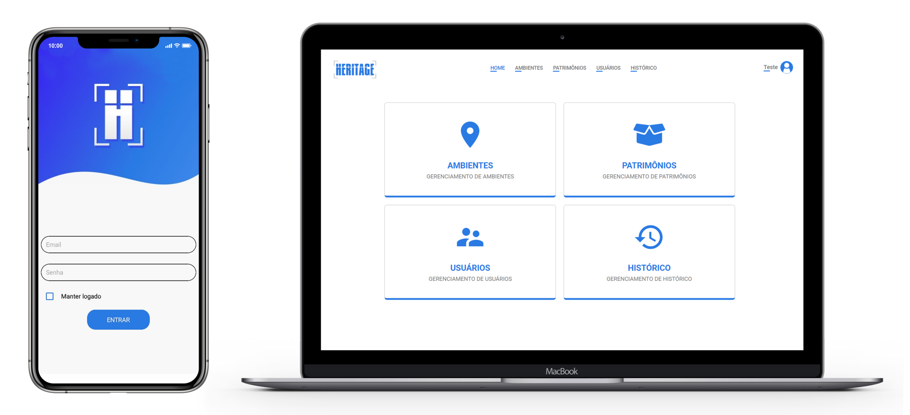

<h1 align="center">
    
</h1>

  <a href="#-instalação-e-execução">Instação e execução</a>&nbsp;&nbsp;&nbsp;|&nbsp;&nbsp;&nbsp;
  <a href="#rocket-tecnologias">Tecnologias</a>&nbsp;&nbsp;&nbsp;|&nbsp;&nbsp;&nbsp;
  <a href="#-projeto">Projeto</a>

 

  

## 🎓 Instalação e execução

1. Faça um clone desse repositório;
2. Entre na pasta rodando `cd TCC-SENAI`;

### Backend

3. Entre na pasta rodando `cd backend`;
4. Rode `yarn` para instalar as dependências;
5. Crie um banco de dados `mysql` com o nome de `heritage`;
6. Renomeie o arquivo `.env.example` para `.env`;
7. Coloque as suas credenciais dentro do `.env`;
8. Rode `yarn sequelize db:migrate` para executar as migrations;
9. Rode `yarn dev` para iniciar o servidor.

### Web

3. Entre na pasta rodando `cd frontend`;
4. Rode `yarn` para instalar as dependências;
6. Rode `yarn start` para iniciar o servidor.

### Mobile

3. Entre na pasta `mobile` pelo `Explorador de Arquivos`;
4. Abra o arquivo `HeritageV04.sln` no [Visual Studio 2019](https://visualstudio.microsoft.com/pt-br/vs/?rr=https%3A%2F%2Fwww.google.com%2F);
5. Crie um emulador com a API do android acima da versão 28 (Pie 9.0);
6. Rode o projeto `HeritageV04.Android` no emulador

## :rocket: Tecnologias

Esse projeto foi desenvolvido com as seguintes tecnologias:

- [Node.js](https://nodejs.org/en/)
- [React](https://reactjs.org)
- [Xamarin.Forms](https://dotnet.microsoft.com/apps/xamarin/xamarin-forms)

## 💻 Projeto

Heritage é um aplicativo de gerenciamento de patrimônios e manutenção desenvolvido para ambientes empresariais, feito para facilitar o dia a dia e agilizar os processos burocráticos envolvendo a conferência de patrimônios e da abertura de chamado de manutenção.

---

Feito com ♥ by Pedro Vignotto :wave: [Contato](https://www.linkedin.com/in/pedro-vignotto/)
